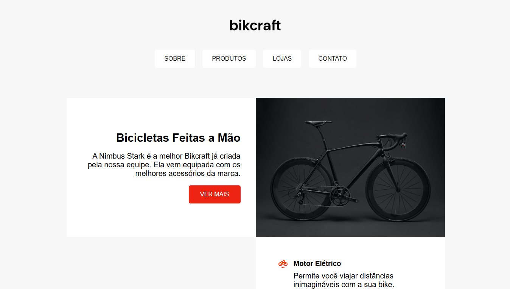

# bikcraft-demo

O protótipo do verdadeiro projeto Bikcraft. Trata-se de uma página aplicando os conceitos de flexbox e grid na qual aprendi, aplicando conceitos de responsividade também.

## Preview

## Link da página

[Página Bikcraft](https://matheusrbmdev.github.io/bikcraft-demo/)
